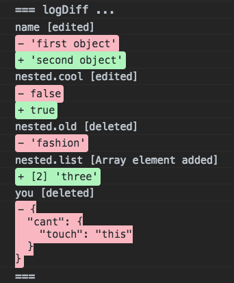

# log-diff

A function that logs the difference between two objects. The differences are printed in a Github-looking style. If you have 2 objects - left and right:

```javascript
const left = {
    name: 'first object',
    nested: {
        cool: false,
        old: 'fashion',
        list: ['one', 'two'],
    },
    you: {
        cant: {
            touch: 'this',
        },
    },
};

const right = {
    name: 'second object',
    nested: {
        cool: true,
        list: ['one', 'two', 'three'],
    },
}

logDiff(left, right);
```

logDiff would print the following:



Keep in mind the order of the arguments for the diff - from the Left Hand Side (**lhs**) to the Right Hand Side (**rhs**) - logDiff(lhs, rhs)

## Getting Started
logDiff is exported in the dist folder as:

* CommonJS module (cjs)
* ES module (esm)
* UMD build (umd)

One fast way to use logDiff straight in the browser is to import the ES module version with dynamic module imports. This is supported by newer versions of Chrome, Firefox, Safari and Edge - see [caniuse.com](https://caniuse.com/#feat=es6-module).

This way logDiff can be loaded like so:

```javascript
(async () => {
  try {
    // Specify where logdiff.esm.js is located
    scriptUrl = '';
    const { default: logDiff } = await import(scriptUrl);
    window.logDiff = logDiff;
    console.log('logDiff loaded!');
  } catch (err) {
    console.log(err);
  }
})();
```

Check **examples/index.html** for example usage.

### Run / Development

For developing logDiff the dependencies can be installed with yarn or npm:

```bash
yarn
# or 
npm install
```

To transpile and bundle run the following:

```bash
yarn build
# or 
npm run build
```

To watch for file changes and trigger a new build:

```bash
yarn dev
# or 
npm run dev
```

## Built With
* [deep-diff](https://github.com/flitbit/diff) - Javascript utility for calculating deep difference, capturing changes, and applying changes across objects; for nodejs and the browser.
* [rollup.js](https://github.com/rollup/rollup) - ES6 module bundler
* [eslint.js](https://github.com/eslint/eslint) - a pluggable tool for identifying and reporting on patterns in JavaScript

## License

[MIT](LICENSE).
